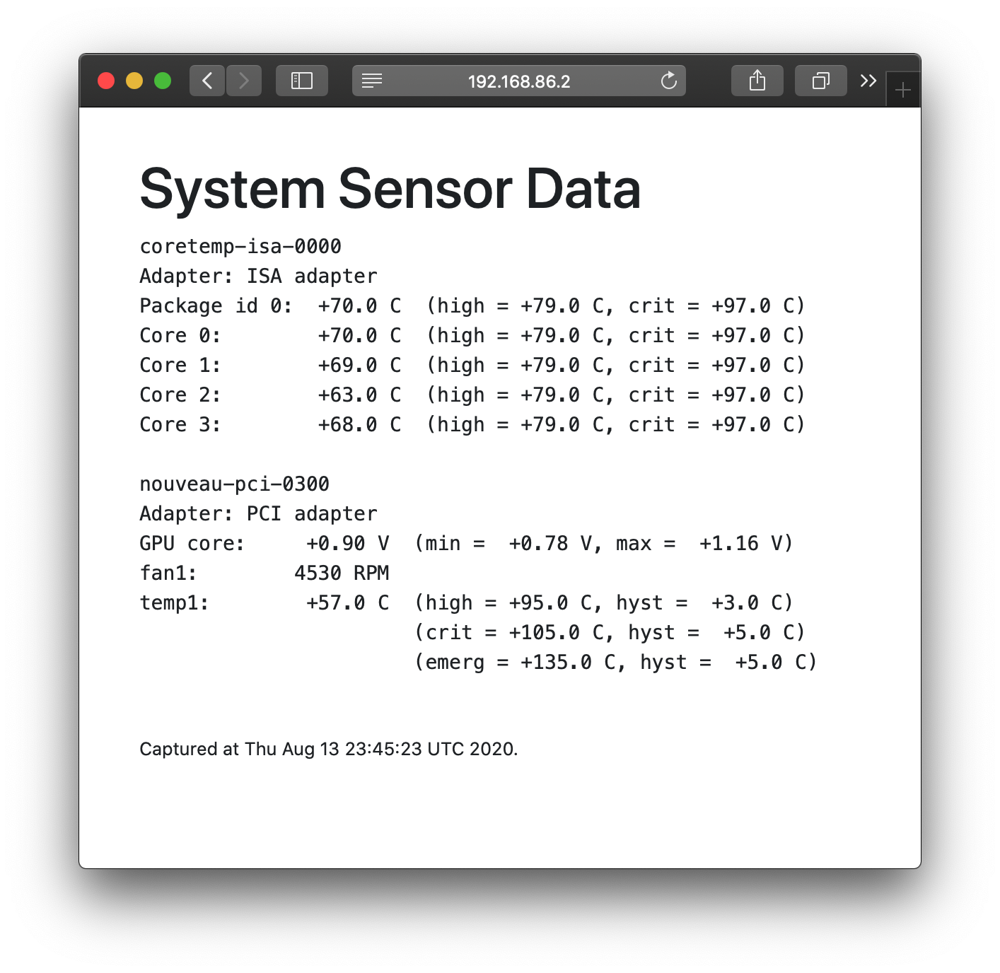

# 🌡️ Docker Host Sensor Page

[](https://hub.docker.com/r/grahamleslie/docker-host-sensor-page)

A simple container that polls your Docker host's temperature sensor data to display in a simple web page.

Run the container in your Docker host, and it will poll system temperatures using `lm-sensors` every minute, and host them on a simple HTML page using Nginx.

<center>
  
</center>

## Installation

Tested on an Ubuntu 18 host.

```bash
docker run \
    -d \
    -p 8080:80 \
    --privileged \
    --name docker-host-sensor-page \
    --restart=always \
    grahamleslie/docker-host-sensor-page:latest
```

## Development

* Install Docker.
* Clone this repository.
* `./start.sh` to build, remove any existing development containers, and start a new one.